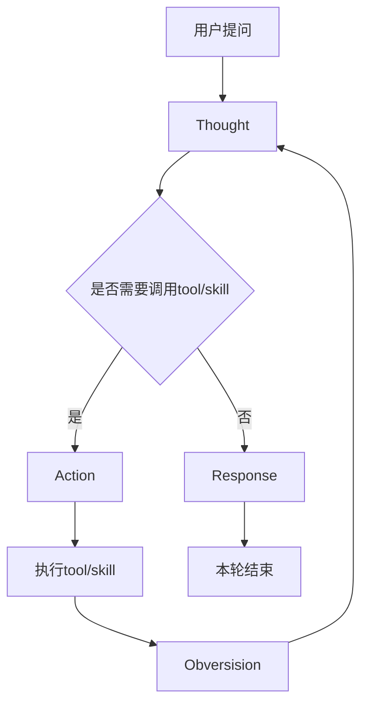
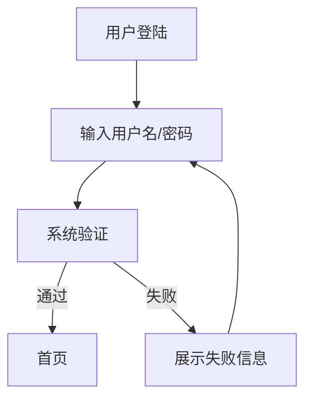
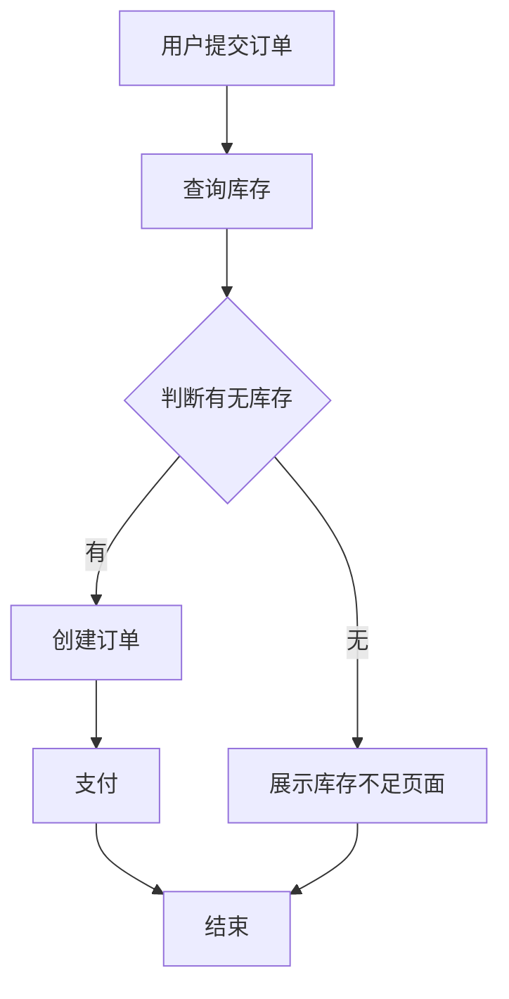
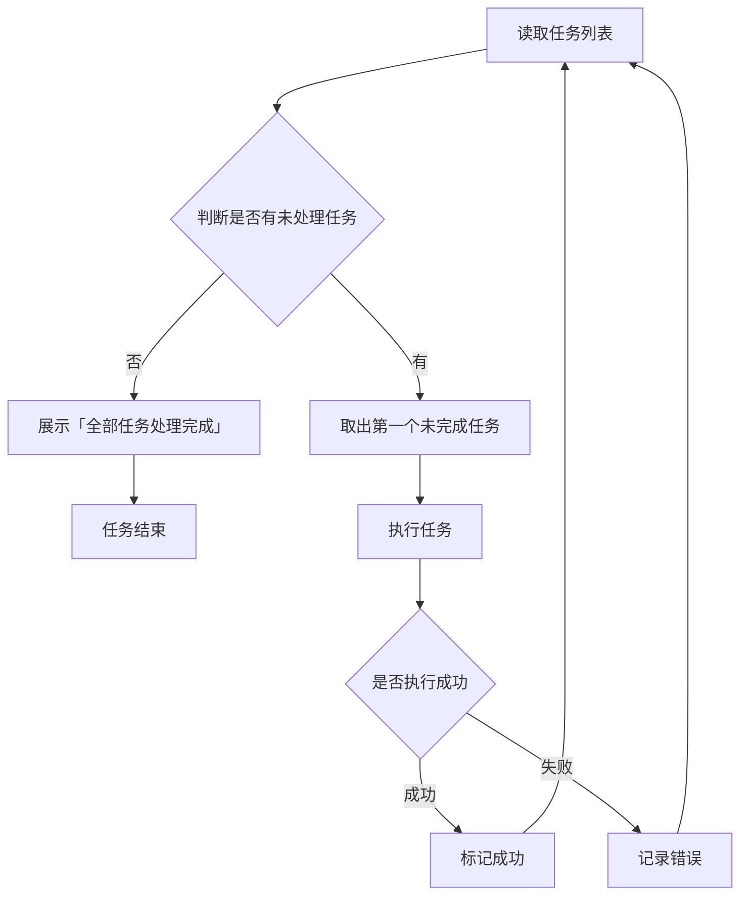
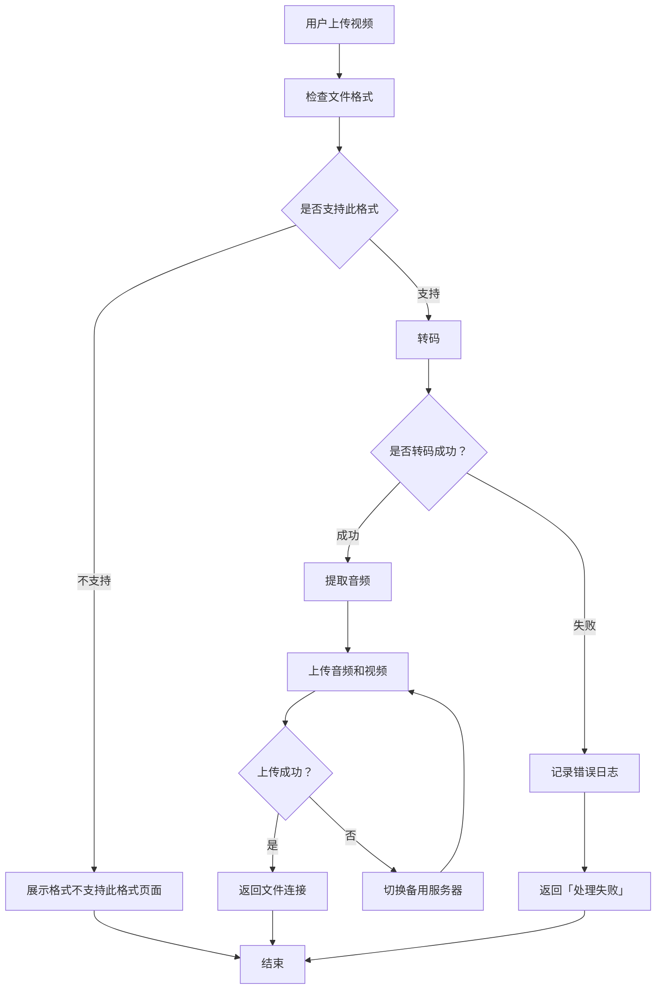
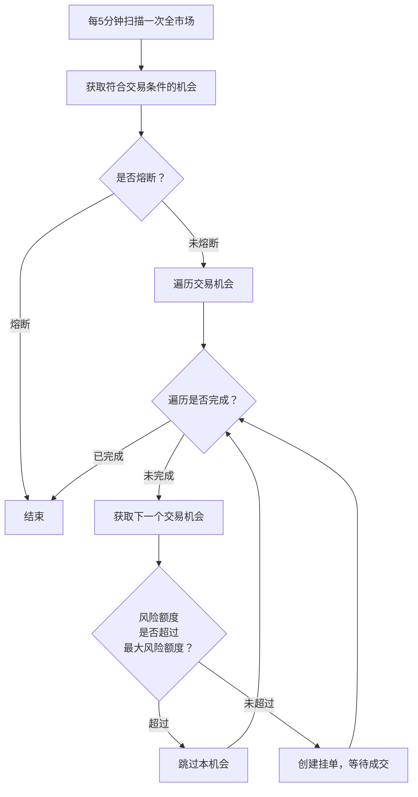

## 小技巧：节点放“动作/状态/判断”，线上放“条件/结果/说明”。

### ReAct执行流程

```mermaid
  flowchart TB

  A[用户提问] --> B[Thought] --> C{是否需要调用tool/skill}

  C -->|是| D[Action] --> D1[执行tool/skill] --> D2[Obversision] --> B
  C -->|否| E[Response] --> F[本轮结束]
```

---

### 用户登录流程

```mermaid
   flowchart TB
   
   A[用户登陆] --> B[输入用户名/密码] --> C[系统验证]
   C -->|通过| D[首页]
   C -->|失败| E[展示失败信息] --> B

```

### 用户提交订单流程

```mermaid
   flowchart

   A[用户提交订单] --> A1[查询库存] --> B{判断有无库存}
   B -->|有| C[创建订单] --> D[支付] --> E[结束]
   B -->|无| F[展示库存不足页面] --> E
```

----

### 任务自动执行流程

```mermaid
   flowchart
   
   A[读取任务列表] --> B{判断是否有未处理任务}
   B -->|否| B1[展示「全部任务处理完成」] --> C[任务结束]
   B -->|有| B2[取出第一个未完成任务] --> B3[执行任务] --> B4{是否执行成功}
   B4 -->|成功| B41[标记成功] --> A
   B4 -->|失败| B42[记录错误] --> A
```

---

### 音视频处理流程

```mermaid
   flowchart
   A[用户上传视频] -->B[检查文件格式] --> C{是否支持此格式}
   C -->|不支持| D[展示格式不支持此格式页面] --> E[结束]
   C -->|支持| F[转码] --> G{是否转码成功？}
   G -->|成功| G1[提取音频] --> G2[上传音频和视频] --> G3{上传成功？}
   G3 -->|是| G3_1[返回文件连接] --> E
   G3 -->|否| G3_2[切换备用服务器] --> G2
   G -->|失败| H[记录错误日志] --> H1[返回「处理失败」] --> E 
```

### 风控流程

```mermaid
   flowchart

   A[每5分钟扫描一次全市场] --> B[获取符合交易条件的机会] --> C{是否熔断？}
   C -->|熔断| C1_1[结束]
   C -->|未熔断| C2[遍历交易机会] --> C2_0{遍历是否完成？} 
   C2_0 -->|未完成| C2_1[获取下一个交易机会] --> C2_2{风险额度\n是否超过\n最大风险额度？}
   C2_0 -->|已完成| C1_1
   C2_2 -->|超过| C2_2_1[跳过本机会] --> C2_0
   C2_2 -->|未超过| C2_2_2[创建挂单，等待成交] --> C2_0

```